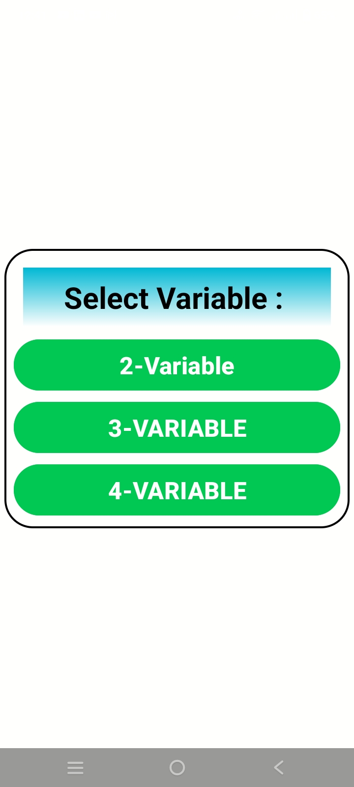
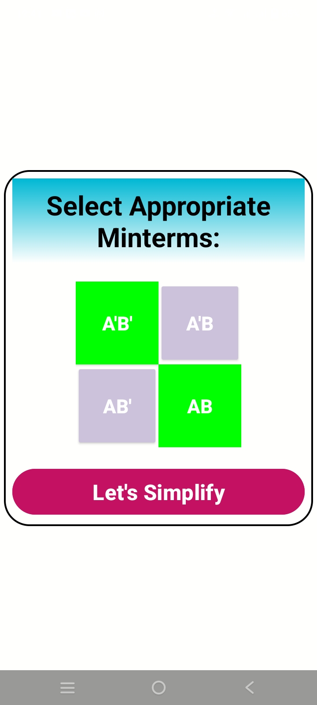
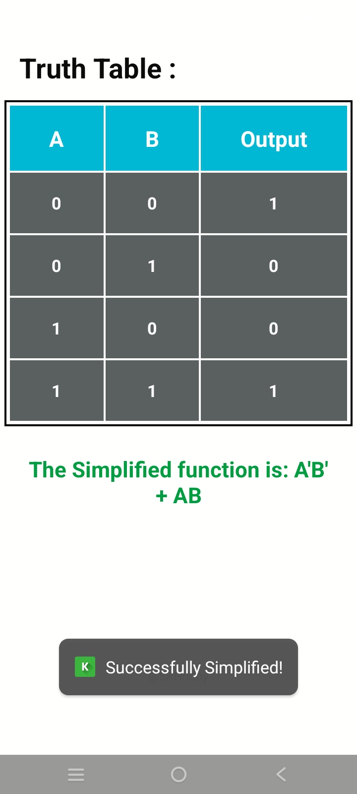
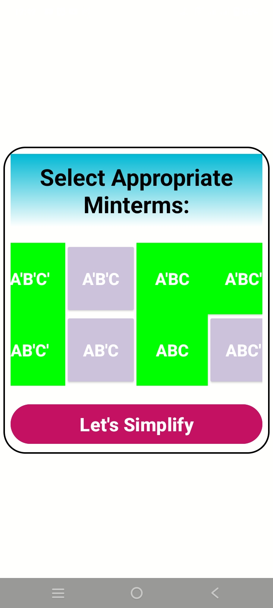
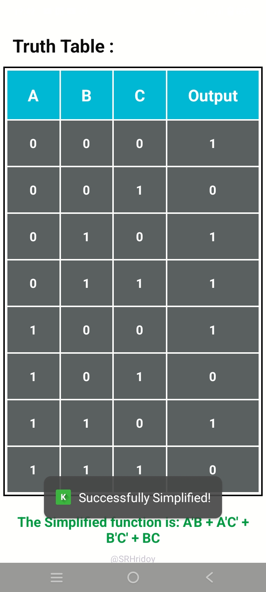

# 🔢 K-Map Solver – Simplify Boolean Expressions  

**K-Map Solver** is an **Android app** built using **Java** that simplifies **Boolean expressions** using **Karnaugh Maps (K-Maps)**. The app provides an interactive way to solve **2-variable and 3-variable K-Maps**, making digital logic design easier.  

## ✨ Features  
✅ **2-Variable K-Map Solver**  
✅ **3-Variable K-Map Solver**  
✅ **User-friendly UI** – Easy selection of minterms  
✅ **Instant Boolean expression simplification**  
✅ **Truth table representation**  

## 🛠️ Tech Stack  
- **Language:** Java  
- **Framework:** Android SDK  
- **UI Design:** XML  

## 📸 Screenshots  








## 🚀 Installation  
1. Clone the repository:  
   ```sh
   git clone https://github.com/SRHridoy/K_Map_Solver.git
